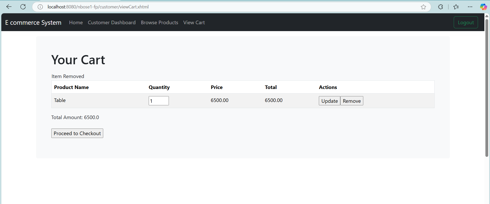
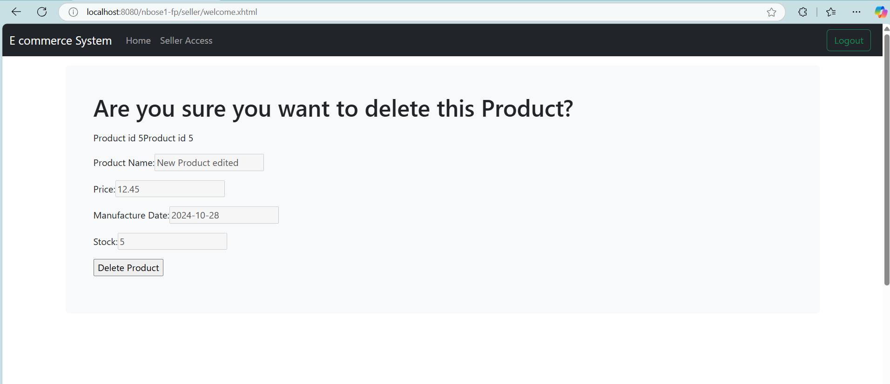

NEKHA BOSE Lab 3 README

**Title: E-Commerce Platform** 

**Project Summary**

The E-Commerce Platform is a robust web application built using Jakarta EE and JSF, enabling users to register as customers or sellers. 
Customers can browse products, manage their shopping carts, and place orders, while sellers can manage their product listings. 
Administrators have the authority to manage users and oversee platform operations.

The web application is designed to facilitate online shopping experiences for both customers and sellers. Platform allows users to register 
either as customers or sellers. Customers can browse products, manage their shopping carts, and place orders, while sellers can manage their
product listings. Administrators have the ability to manage users and oversee the entire platform.

In this project, I aimed to fulfill all the requirements specified in the project guidelines:

User Authentication and Authorization: Implemented secure login and registration processes with role-based access control for Sellers and Customers.

Entity Relationships: Designed and implemented entities such as User, Group, Customer, Seller, Product, Order, and OrderLine with appropriate relationships.

CRUD Operations: Provided full CRUD functionality for managing products and users.

Shopping Cart and Order Processing: Enabled customers to add products to a cart, proceed to checkout, and receive order confirmations.

Security Configuration: Configured security realms and data sources, ensuring secure data handling and user authentication.

Responsive Design: Utilized Bootstrap to create a user-friendly interface.

**Design**
Implemented the following key functionalities:

User Registration and Authentication:

Users can sign up as either Customers or Sellers.Secure login is enforced using Jakarta Security.Role-based access control ensures users have
access only to relevant functionalities.

Admin Dashboard:

View all products available on the platform.

Seller Dashboard:

Sellers can add, edit, delete, and view their products.Product management is facilitated through a reusable composite component for consistency.

Customer Experience:

Customers can browse and search for products using filters like name and price range.A shopping cart system allows customers to add products, 
adjust quantities, and remove items.Secure checkout process with stock validation and order confirmation.

Navigation Flow:

Upon logging in, users are directed to their respective dashboards based on their roles.Role-specific navigation menus provide access to 
relevant functionalities.For a customer a seamless transition between browsing products, managing the cart, and checking out is implemented.
Sellers can navigate between product management options from their dashboard.

Navigation Flow Details:

Login Page:

Users enter their credentials and are authenticated.
Redirected to the appropriate dashboard based on their role.

Admin Dashboard:
Access to user management and an overview of all products.
Option to create new users.

Seller Dashboard:

View a list of their products.
Options to add new products or edit/delete existing ones.
Navigation to product detail views.

Customer Dashboard:

Welcome message with options to browse products or view the shopping cart.
Can access the product browsing page to search and filter products.

Product Browsing:

Displays a list of products with search and filter options.
Customers can add products to their cart directly from this page.

Shopping Cart:

Lists all products added to the cart.
Options to update quantities or remove items.

Proceed to checkout.
Checkout:

Displays order summary and total amount.
Customers confirm their order.
Order Confirmation:

Order details are displayed along with a confirmation message.
Option to return to the dashboard.

**Requirements**

Installations

Database: MySQL Server 8.4 or higher

Start your MySQL Server.
Open the MySQL Workbench or command-line interface and execute:
1) Locate the SQL Client in your system
2) For MySQL, type mysql -u [username] -p (it will then prompt you for a password).
3) Provide username ans password as itmd4515

IDE: NetBeans 
Download NetBeans and load the files.
Always clean and build befor you run your project.

Application Server: Payara 
Download Payara

Steps to Run and build the project

1)Start your MySQL Server.

2)Open the MySQL Workbench or command-line interface and execute:
 drop schema itmd4515; create schema itmd4515; use itmd4515;

3)Update the ITMD4515DataSourceConfig.java file in the project to include your database credentials:

@DataSourceDefinition(
   name="java:app/jdbc/itmd4515DS",
   className = "com.mysql.cj.jdbc.MysqlDataSource",
   serverName = "localhost",
   portNumber = 3306,
   databaseName = "itmd4515",
   user = "your_db_username",
    password = "your_db_password",
   properties = {
       "zeroDateTimeBehavior=CONVERT_TO_NULL",
        "useSSL=false",
        "allowPublicKeyRetrieval=true"
   }
)

4)Clean and Build the Project

5)Deploy to Application Server
Using Payara:

Start the Payara Server.

Tool and Library Versions

**Screen Captures**

User	  Password

nekha	  nekha

ginet     ginet

gayathri  gayathri

pranav	  pranav

noyal	  noyal

admin	  admin

User	Group

nekha	  customerGroup

nekha	  sellerGroup

nekha	  adminGroup

pranav	  sellerGroup

noyal	  sellerGroup

ginet     customerGroup

gayathri  customerGroup

admin	  adminGroup

Signup Page, Creating account for customer

Login page, customer #anu

Browse Products, # desktop

Adding one more product without searching, Clicked on Table. Then we will click on view cart to view the items in the cart.

Updating quantity of Test product to 3

Provide the quantity number and click on update.

We could see the product has been updated and the price has been reflected.

Now click on remove button for the product "Test product", to verify the delete functionality.

Proceed to checkout

Confirm Checkout

Signup Page, Creating account for seller

Login page, seller # pranav

Add new product

Editting

View Details page

Delete

Admin

Seller Dashboard

Create Product Page

Edit Product Page

Delete Product Confirmation

**Expected Results/Known Issues**

Expected Results

User Registration and Login:

Users can successfully register as customers or sellers.
Registered users can log in and are redirected to their respective dashboards based on their roles.

Seller Functionalities:

Sellers can add new products to their listings.
Sellers can edit or delete their existing products.
Sellers can view detailed information about their products.

Customer Functionalities:

Customers can browse and search for products.
Customers can add products to their cart, adjust quantities, or remove items.
Customers can proceed to checkout, place orders, and receive order confirmations.

Known Issues

1)UI Enhancements:

Some pages may require additional styling for improved user experience.

2)Signup Redirection Issue:
Description: After successfully signing up, users are not automatically redirected to the landing page. Instead, they remain on the signup confirmation page.
Impact: Users have to manually navigate to the login page after signing up, which may cause confusion or inconvenience.

Test Script

Create a New Seller User
1)Navigate to the login page.
2)Click on link Dont have an account?Sign up here!
3)Provide the details, select the account type as "seller" and click on sign up button 
4)It will be successful. But you need to click on the "Already have an account? Login here!" to login 

Expected Result: On successful sign up it should either land to login page or Landing page( Respective users landing page).

**Development Insights**

Embarking on the development of the E-Commerce Platform has been a rewarding journey that has significantly enhanced my skills in Jakarta EE
and JSF. Here's a glimpse into my development experience:

What I Learned
Jakarta EE Mastery: Delved deep into Jakarta EE components like EJBs, JPA, and Jakarta Security, understanding their integrations and best practices.

JSF and Facelets: Gained proficiency in building dynamic and reusable UI components using JSF and Facelets, streamlining the development process.

Role-Based Security: Implemented robust authentication and authorization mechanisms, ensuring secure access across different user roles.

Composite Components: Created reusable composite components to handle repetitive UI elements, promoting DRY (Don't Repeat Yourself) principles.

Challenges Faced

Managing Complex Relationships: Designing bidirectional relationships between entities like User and Group required meticulous planning to prevent 
issues like infinite recursion.
Error Handling: Crafting meaningful error messages and handling exceptions gracefully was crucial for a seamless user experience.

Areas for Further Exploration

Real-Time Features: Integrating WebSockets to provide real-time notifications about order statuses and inventory changes.
Advanced UI Enhancements: Leveraging libraries like PrimeFaces to introduce more interactive and feature-rich UI components.

What I Enjoyed
Clean Architecture Design: Structuring the application with a clear separation of concerns made development efficient and the codebase maintainable.
User Experience Focus: Designing a responsive and intuitive UI using Bootstrap was fulfilling, ensuring that users have a pleasant interaction with the platform.
Problem-Solving: Tackling challenges related to security implementations and complex entity relationships honed my problem-solving skills.
Overall, this project not only provided a platform to apply theoretical knowledge but also offered practical insights into building a secure, scalable, and user-friendly web application.

 

