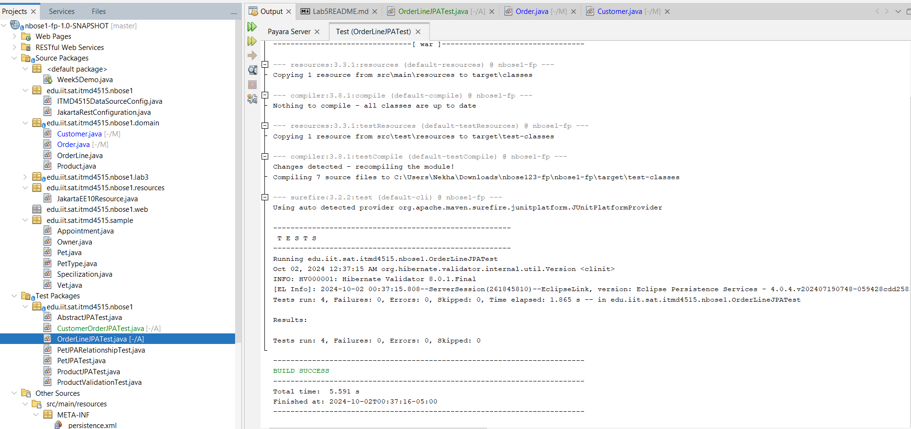
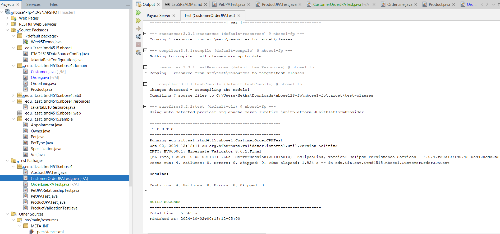
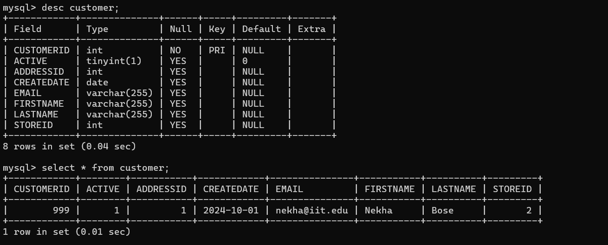

Nekha Bose Lab 5 README file

**Customer**
1. Customer - Order Relationship (One-to-Many, Bidirectional):
This relationship is bidirectional, meaning both the Customer and Order entities are aware of each other. The Customer can have many orders, while each Order references one Customer.

The Customer entity has a list of Order objects, representing all the orders made by that customer.
The Order entity has a reference back to the Customer to show which customer placed the order.

**Order**
2. Order - OrderLine Relationship (One-to-Many, Bidirectional):
This relationship is also bidirectional. The Order can have multiple OrderLine entries, while each OrderLine belongs to a specific Order.

The Order entity has a list of OrderLine objects, representing the individual items in the order.
The OrderLine entity references back to the Order it belongs to.

**OrderLine**
3. OrderLine - Product Relationship (Many-to-One, Unidirectional):
This relationship is unidirectional, meaning only the OrderLine entity knows about the Product. Each OrderLine references a specific Product, but the Product entity does not keep track of which OrderLines include it.

The OrderLine entity has a reference to the Product, showing which product was ordered.
The Product entity does not reference the OrderLine, so it doesn't "know" which orders include it.

**Relationship Testing Summary:**

Uni-directional Relationship: In the OrderLineJPATest, we tested the uni-directional relationship between Order and OrderLine. 
Here, the Order knows about its OrderLines, but the OrderLine doesn't hold a reference back to the Order. We confirmed that after
saving the Order, it contains the correct number of OrderLines, and each OrderLine is linked to the right Product. This ensures 
the one-way relationship is working as expected.

Bi-directional Relationship: In the CustomerOrderJPATest, we focused on the bi-directional relationship between Customer and 
Order. In this case, both the Customer and Order are aware of each other. The tests show that when a Customer is saved, the 
associated Order is also saved, and both entities maintain their connection to each other. We verified this by checking that 
the Customer includes its Order, and the Order knows its Customer.

**************

Introducing JPA functionality to your existing web application by refactoring your Servlet from Lab 3 to use an EntityManager
 and UserTransaction instead of JDBC

