Nekha Bose Lab 8 README file

1. Include screenshots and narrative to prove:
   Your authentication is working.
   You know who the authenticated user is
   You know what role(s) the authenticated user has
   **Documentation Provided**

2.
mysql> select * from sec_user;
+----------+----------+
| USERNAME | PASSWORD |
+----------+----------+
| admin    | admin    |
| owner1   | owner1   |
| owner2   | owner2   |
| vet1     | vet1     |
| vet2     | vet2     |
| vet3     | vet3     |
+----------+----------+

mysql> select * from sec_user_groups;
+----------+-------------+
| USERNAME | GROUPNAME   |
+----------+-------------+
| admin    | ADMIN_GROUP |
| vet1     | ADMIN_GROUP |
| owner1   | OWNER_GROUP |
| owner2   | OWNER_GROUP |
| vet2     | OWNER_GROUP |
| vet1     | VET_GROUP   |
| vet2     | VET_GROUP   |
| vet3     | VET_GROUP   |
+----------+-------------+

3.
**Discuss your experiences, including any difficulties you had or changes you made**

Working with Jakarta EE security and JSF was both challenging and rewarding. Setting up secure login, managing different
 roles (like admin, vet, and owner), and ensuring users could only access their allowed sections gave me a hands-on feel 
for building secure applications. Integrating the backend security setup with JSF for login and logout also underscored how
 important it is to have everything smoothly connected between the frontend and backend.

Challenges
Role-Based Access Control: Setting up access for different roles (admin, vet, owner) was tricky at first,especially in 
matching roles in web.xml and payara-web.xml with database groups. Testing and troubleshooting permissions took some time to 
ensure each role had the right access.

*******Retail-Domain*******
1)

I have 3 different Group in my domain. They are CUSTOMER_GROUP, SELLER_GROUP, ADMIN_GROUP

customerGroup: Represents the group of users who are e-commerce customers.
sellerGroup: Represents the group of users who are sellers on the platform.
adminGroup: Represents the group of users who are platform administrators.

admin: A user with the username "admin" and password "admin". This user is assigned only to the adminGroup, so they have 
admin-level permissions.

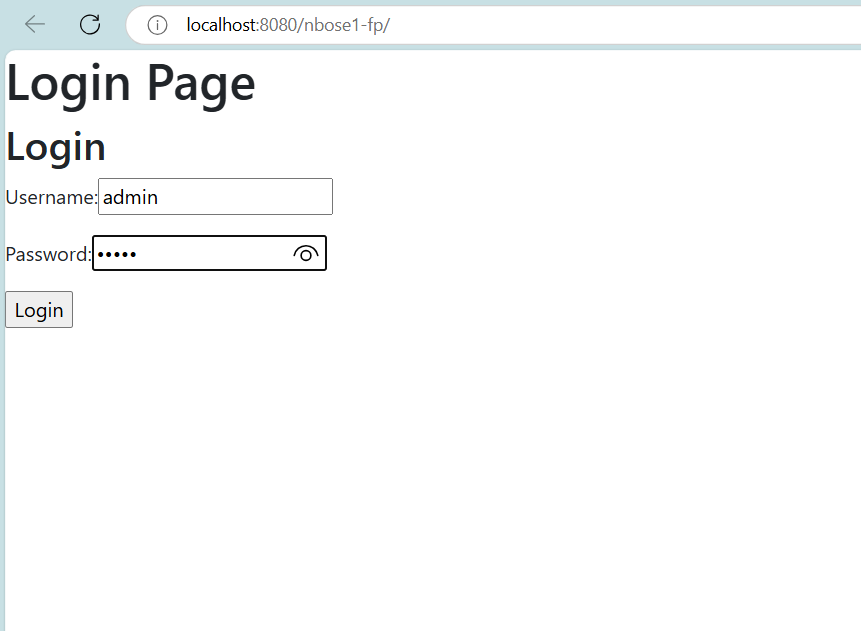

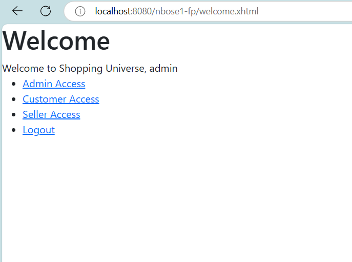

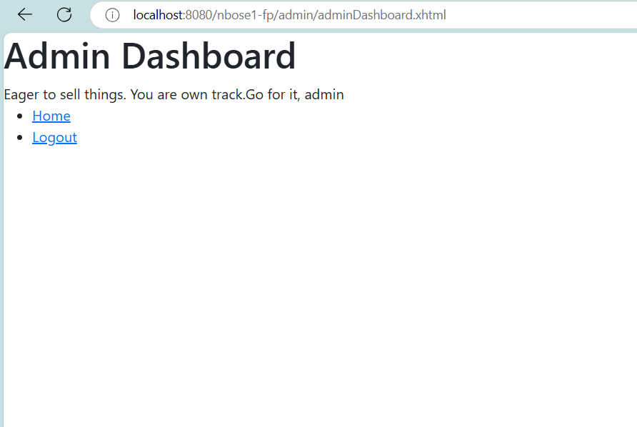

When the user tries to access the unauthorized page.

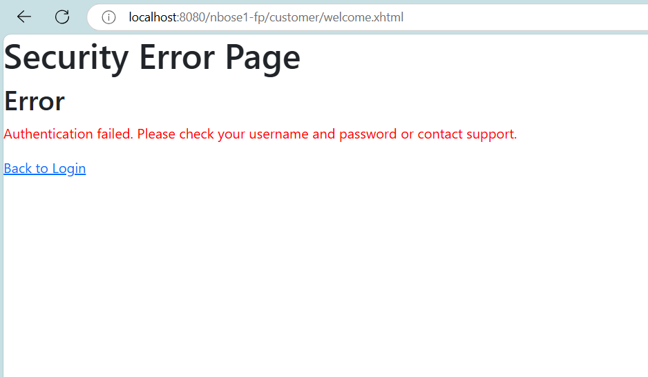

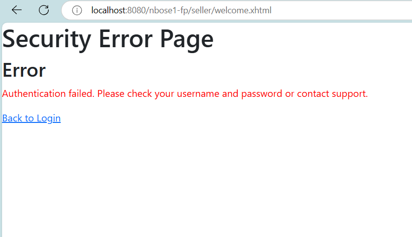

customer1: A user with the username "nekha" and password "nekha". This user is assigned to all three groups (customerGroup, 
sellerGroup, adminGroup), meaning they have access to all roles.

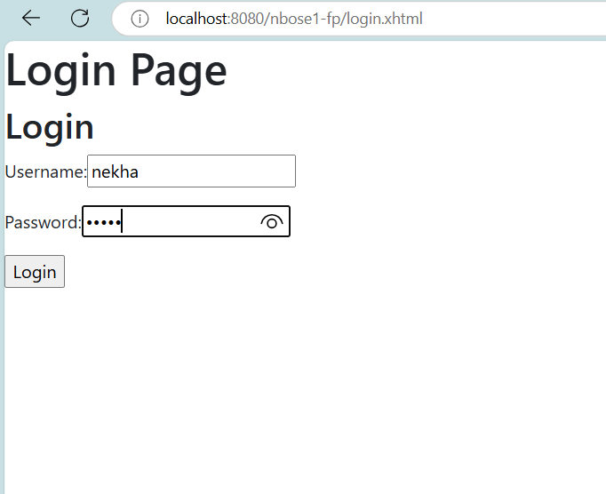

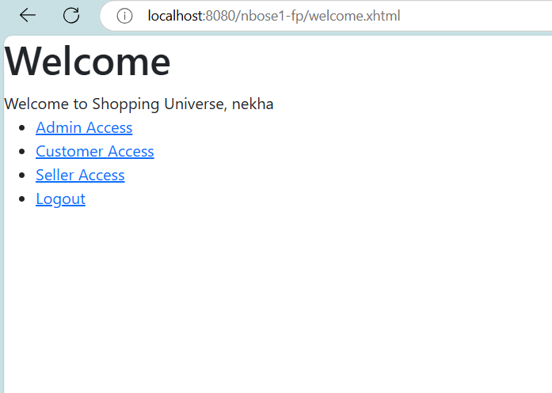

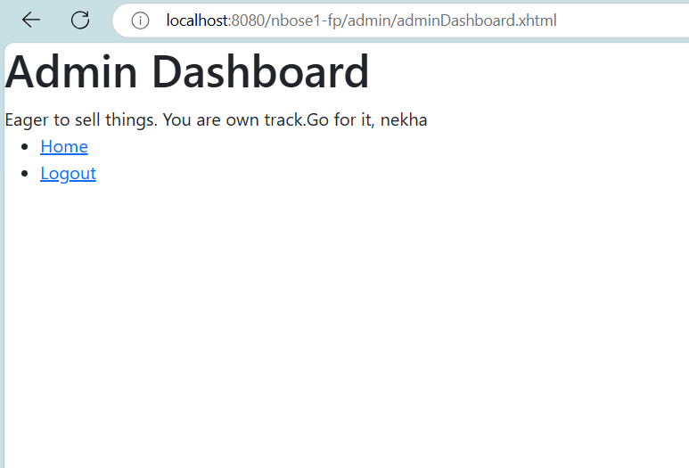

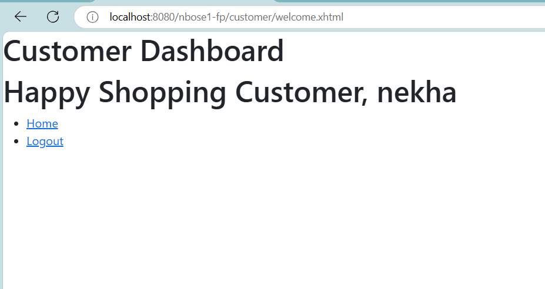

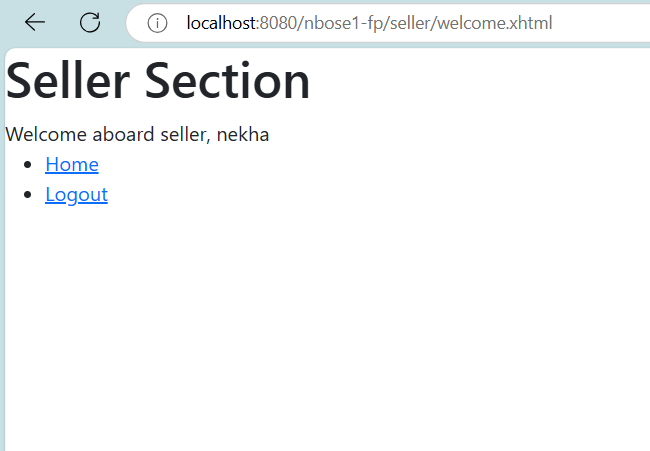

seller1 and seller2: Users with the usernames "pranav" and "noyal", respectively. They are assigned only to the sellerGroup,
so they have seller-level permissions.

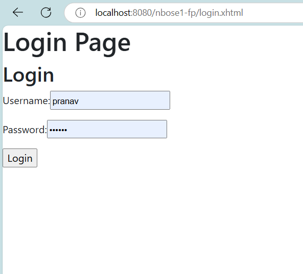

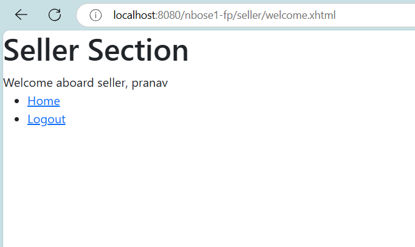

When the user tries to access the unauthorized page.

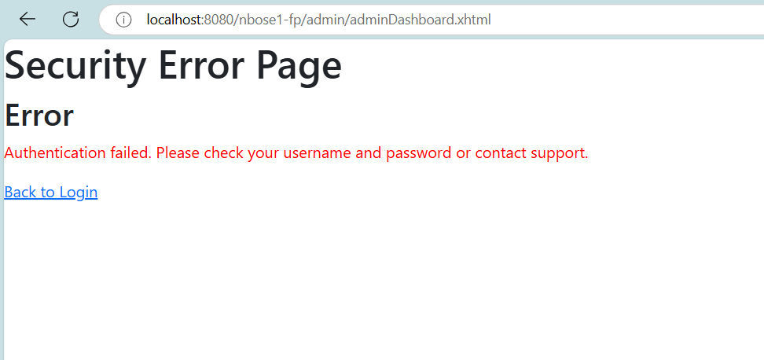

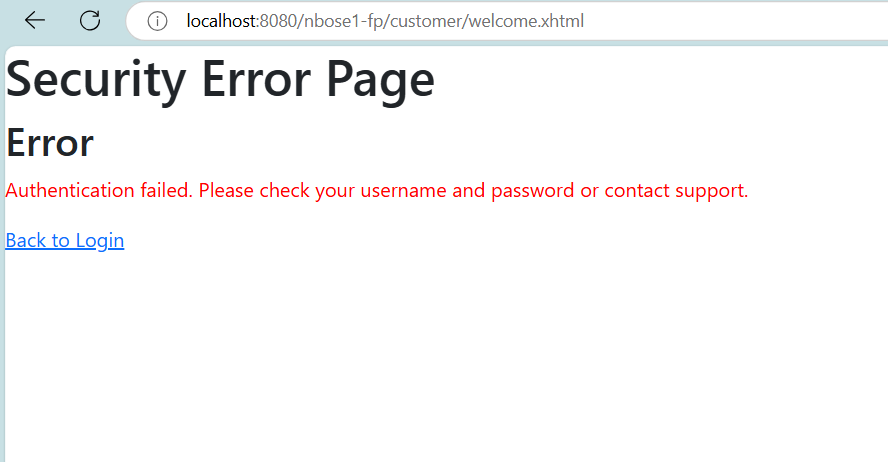

When the login fails due to wrong password

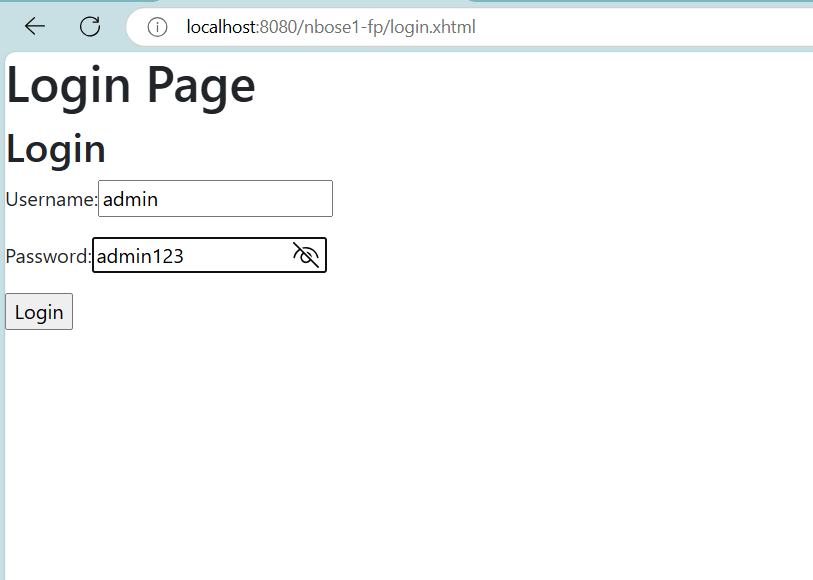

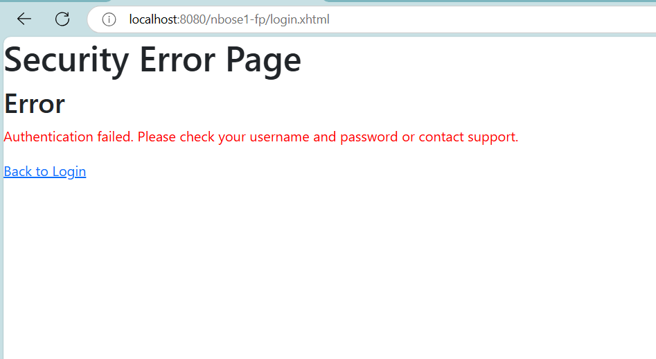

2)

User	Password
nekha	nekha
pranav	pranav
noyal	noyal
admin	admin

User	Group
nekha	customerGroup
nekha	sellerGroup
nekha	adminGroup
pranav	sellerGroup
noyal	sellerGroup
admin	adminGroup

1. Defined roles for admin, customer, and seller in `web.xml`.
2. Mapped these roles to groups (ADMIN_GROUP, CUSTOMER_GROUP, SELLER_GROUP) in `payara-web.xml`.
3. Created the `LoginController.java` to handle the login and logout process.
4. Assigned each role to a group in `StartupService.java`, so users get the right permissions when they log in.

3)
**Discuss your experiences, including any difficulties you had or changes you made**

Setting up role-based security was straightforward initially, but I ran into some issues with the login/logout flow. At first, my doLogout() 
method was being triggered unexpectedly, which caused automatic logouts after logging in. I realized this was due to the way certain 
components were interacting, so I made some adjustments to the command link that handled logging out.Testing access for each role was another
 challenge. I had to log in as each user type (admin, customer, and seller) to make sure access was restricted correctly. Setting up each user’s
access permissions and seeing it all work smoothly was satisfying. Overall, this lab was a great hands-on experience in configuring and testing
security in a real application.

