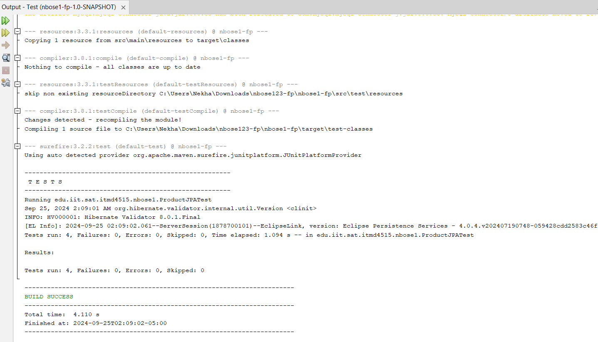
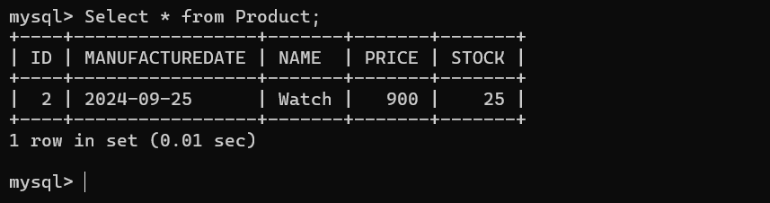
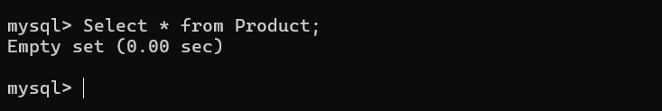
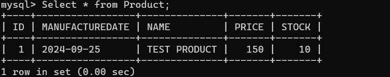
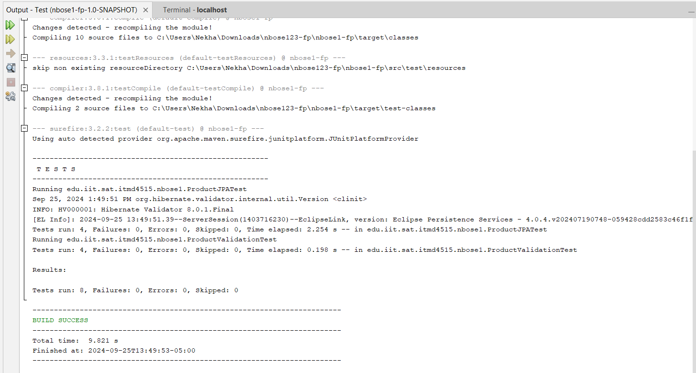

Nekha Bose Lab 4 README file

*****Inital Entity Created *****

The domain i chose over here is Retail and the entity i had created is Product Entity 

1. Use an appropriate PK strategy, and use an appropriate data type for your PK:
The Product entity uses Long as the data type for its primary key (id). The ID is auto-generated by the database, 
which is a common approach in enterprise applications, ensuring that each product has a unique identifier.

2. Include appropriate equals and hashCode methods for your PK strategy:
The equals and hashCode methods are based on the primary key (id). These methods ensure that two Product objects are 
treated as equal if their id values are the same. This is crucial for collections or comparisons in enterprise applications.

3. Include at least one temporal data type:
The manufactureDate field is used to represent a temporal attribute, which tracks when the product was manufactured. It uses the
 @Temporal(TemporalType.DATE) annotation to indicate that only the date (without time) should be stored in the database.

4. Include at least three different data types:
The entity uses various data types for its attributes:

-String for the name of the product.
-BigDecimal for the price of the product, which is ideal for financial data because of its precision.
-Date for manufactureDate, which is a temporal type.
-Integer for stock, representing the number of products in inventory.

5. Include appropriate Constructors, accessors, and mutators:
The entity provides two constructors:

-A no-argument constructor, which is required by JPA for creating entities.
-A parameterized constructor for convenient initialization of the entity with values.
Getters and setters (accessors and mutators) are provided for all the fields, allowing controlled access and updates 
to the entity’s attributes.

6. Include appropriate bean validation constraints based on your database types and sizes:
Bean validation is used to ensure that the data remains consistent and valid before it’s persisted in the database:

-@NotNull for the product name ensures that a product must have a name.
-@DecimalMin("0.0") for the price ensures that the price is at least 0 (i.e., no negative prices).
-@Min(0) for the stock ensures that the stock count can never be negative.

7. Include appropriate toString method for formatted output:
The toString method is overridden to provide a readable and structured output of the Product object’s attributes. This is
 helpful for logging, debugging, or displaying the product details in a human-readable form.

***************************************************************************************************************************************

**1. Business Domain: Retail**
I chose the Retail domain for this project because it’s a fast-moving, constantly evolving industry that plays a significant role in our 
everyday lives and the global economy. Whether shopping in stores or online, we all interact with retail in some way. Retail involves 
everything from creating and distributing products to managing inventory, setting prices, and improving customer satisfaction. These areas
 are filled with challenges and opportunities that can be addressed with data and technology.

By focusing on the retail sector, I can dive into these complexities and design smarter, automated solutions that not only streamline business 
operations like inventory management and pricing strategies but also enhance customer experiences. Retail’s wide range of activities and its 
direct impact on consumers make it an ideal area to explore innovative, data-driven applications.

**2. Additional Entities and Their Relationships**
Although Lab 4 focuses on just one entity—the Product—a complete retail system involves several other important pieces that work together. 
For example, a Customer entity would represent the people buying the products, and an Order entity would record the details of each purchase.
 A ShoppingCart entity could help track the items customers have selected before they make a purchase. On the backend, an Inventory entity
 would make sure the stock levels are accurate and up-to-date, and a Supplier entity would handle the relationships with the manufacturers
 and distributors who provide the products.

****************************************************************************************************************************************

**Test Class Output**

Here is the output of my `ProductJPATest` class. The tests are designed to ensure that the CRUD operations (Create, Read, Update, 
Delete) for the Product entity work correctly.

1) Create Test

The create test ensures that a Product entity is correctly persisted in the database. After persisting, the ID is auto-generated, and a 
second check ensures the product details can be retrieved with the correct name.

2) Read Test

The read test ensures that a persisted Product entity can be successfully retrieved from the database using its ID. The test checks that 
all attributes are read correctly.

3) Update Test

The update test verifies that an existing Product entity can be modified in the database. In this case, we update the product's price
The test checks that the changes are correctly reflected in the database after the transaction is committed.

4) Delete Test

The delete test ensures that the Product entity is removed from the database. After deletion, the product cannot be found, and the test
 checks that the entity is no longer present in the database.

 **ProductValidationTest**
 